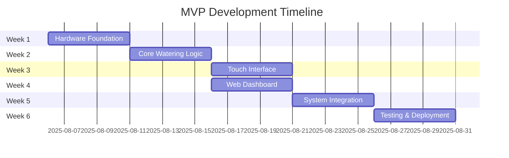

# MVP Development Epics - Plant Watering System

**Source:** IoT-Plant-Watering-MVP-PRD.md  
**Timeline:** 6 weeks  
**Budget:** €200  
**Generated:** August 6, 2025  

---

## Epic Overview

| Epic | Duration | Dependencies | Team Size | Risk Level |
|------|----------|-------------|-----------|------------|
| **E1: Hardware Foundation** | Week 1 | None | 1 developer | LOW |
| **E2: Core Watering Logic** | Week 2 | E1 Complete | 1 developer | MEDIUM |
| **E3: Touch Interface** | Week 3 | E2 Complete | 1 developer | MEDIUM |
| **E4: Web Dashboard** | Week 4 | E2 Complete | 1 developer | LOW |
| **E5: System Integration** | Week 5 | E3, E4 Complete | 1 developer | HIGH |
| **E6: Testing & Deployment** | Week 6 | E5 Complete | 1 developer + Users | HIGH |

---

## Epic 1: Hardware Foundation & Setup

**Duration:** Week 1  
**Goal:** Establish reliable hardware platform with all sensors operational  
**Owner:** Technical Lead  
**Priority:** P0 (Blocking)  

### User Stories

**E1.1: Component Procurement & Validation**
```
As a technical user
I want all hardware components procured and tested  
So that development can proceed without hardware blockers

Acceptance Criteria:
- [ ] ESP32 DevKit functional and programmable
- [ ] 2.8" Touch TFT Display operational with test patterns
- [ ] HC-SR04 Ultrasonic sensor providing accurate distance readings
- [ ] 2x Moisture sensors calibrated and providing 0-100% readings
- [ ] 12V pump tested with pressure capability for 5m lift + 10m horizontal
- [ ] Power supply providing stable 12V/5V with safety margin
- [ ] All wiring and connections tested for reliability
- [ ] Component cost tracked and within €150 allocation

Story Points: 5
```

**E1.2: Development Environment Setup**
```
As a developer
I want MicroPython development environment configured
So that I can efficiently write and deploy code

Acceptance Criteria:
- [ ] MicroPython flashed to ESP32 successfully
- [ ] IDE configured for ESP32 development (Thonny/VSCode)
- [ ] GPIO pin assignments documented and tested
- [ ] Basic sensor reading scripts working
- [ ] File transfer to ESP32 operational
- [ ] Version control setup for project

Story Points: 3
```

**E1.3: Sensor Integration & Calibration**
```
As a technical user
I want all sensors accurately calibrated and integrated
So that watering decisions are based on reliable data

Acceptance Criteria:
- [ ] Moisture sensors calibrated (dry=0%, saturated=100%)
- [ ] Ultrasonic sensor accurate within ±2cm for water level
- [ ] Sensor reading frequency established (30-second intervals)
- [ ] Data filtering implemented for sensor noise reduction
- [ ] GPIO pin mapping documented and tested
- [ ] Sensor failure detection implemented (timeout, range checking)

Story Points: 8
```

**Epic 1 Definition of Done:**
✅ All hardware components operational  
✅ ESP32 development environment functional  
✅ Sensor readings accurate and reliable  
✅ Budget tracking on target (<€150)  
✅ Week 2 dependencies met  

---

## Epic 2: Core Watering Logic & Safety

**Duration:** Week 2  
**Goal:** Implement reliable automated watering with comprehensive safety systems  
**Owner:** Technical Lead  
**Priority:** P0 (Core Feature)  

### User Stories

**E2.1: Moisture Monitoring System**
```
As a plant owner  
I want the system to continuously monitor soil moisture
So that my plants receive water when needed

Acceptance Criteria:
- [ ] Moisture sensors read every 30 seconds
- [ ] Individual thresholds configurable per plant (0-100%)
- [ ] Threshold breach detection triggers watering sequence
- [ ] Time window enforcement (8AM-8PM only)
- [ ] Sensor data logged with timestamps
- [ ] Multiple sensor failure handling (backup logic)

Story Points: 8
```

**E2.2: Volume Control & Measurement**
```
As a technical user
I want precise volume control for each watering event
So that plants receive optimal water amounts without waste

Acceptance Criteria:
- [ ] Volume calculation using ultrasonic before/after measurement
- [ ] Configurable volume per plant (100ml-500ml range)
- [ ] Default volume set to 200ml per plant
- [ ] Volume accuracy sufficient for plant care (±10%)
- [ ] Watering event logging (timestamp, volume, plant)
- [ ] Volume tracking and usage analytics

Story Points: 13
```

**E2.3: Safety Systems & Pump Control**
```
As a system user
I want comprehensive safety systems to prevent damage
So that the system operates safely without supervision

Acceptance Criteria:
- [ ] Maximum watering time limit (60 seconds timeout)
- [ ] Pump dry-run protection (level check before start)
- [ ] Continuous pumping detection and alert
- [ ] Emergency stop capability via manual override
- [ ] Pump relay control with fail-safe position
- [ ] Error logging and recovery procedures
- [ ] Leak detection through continuous flow monitoring

Story Points: 13
```

**Epic 2 Definition of Done:**
✅ Automated watering functional for both plants  
✅ Volume control accurate and logged  
✅ All safety systems operational and tested  
✅ 48-hour autonomous test completed successfully  
✅ Error handling and recovery verified  

---

## Epic 3: Touch Interface & Local Controls

**Duration:** Week 3  
**Goal:** Intuitive touch interface accessible to both technical and non-technical users  
**Owner:** Frontend Developer  
**Priority:** P0 (User Experience)  

### User Stories

**E3.1: Status Display System**
```
As a non-technical user
I want clear visual status of system health and plant conditions
So that I can quickly understand if action is needed

Acceptance Criteria:
- [ ] Real-time moisture levels displayed as percentage bars
- [ ] Water reservoir level shown as visual gauge
- [ ] Last watering timestamps for both plants
- [ ] System status indicators (operational/error/offline)
- [ ] Clear, readable fonts and high contrast design
- [ ] Status updates every 30 seconds automatically

Story Points: 8
```

**E3.2: Manual Watering Controls**
```
As any user
I want simple manual watering controls for immediate plant care
So that I can supplement automatic care when needed

Acceptance Criteria:
- [ ] Large, clearly labeled "Water Plant 1" and "Water Plant 2" buttons
- [ ] Volume selection for manual watering (100ml, 200ml, 300ml options)
- [ ] Progress indicator during manual watering
- [ ] Confirmation dialog to prevent accidental activation
- [ ] Manual watering logged same as automatic events
- [ ] Emergency stop button accessible during operation

Story Points: 8
```

**E3.3: Basic Settings Configuration**
```
As a technical user
I want configurable settings accessible via touch interface
So that I can optimize system behavior per plant

Acceptance Criteria:
- [ ] Moisture threshold adjustment per plant (slider/numeric input)
- [ ] Default watering volume configuration
- [ ] Time window settings (start/end times)
- [ ] System language/units selection
- [ ] Settings validation and error handling
- [ ] Settings persistence across system restarts

Story Points: 13
```

**E3.4: Alert & Notification Display**
```
As any user
I want clear alerts for system issues and required actions
So that I can respond appropriately to system needs

Acceptance Criteria:
- [ ] Low water level warnings with clear refill instructions
- [ ] Sensor malfunction alerts with troubleshooting steps
- [ ] Pump failure notifications with emergency contact info
- [ ] Alert acknowledgment system (dismiss/snooze options)
- [ ] Visual alert indicators (color coding, icons)
- [ ] Alert history for reference and troubleshooting

Story Points: 8
```

**Epic 3 Definition of Done:**
✅ Both users can operate touch interface independently  
✅ Manual watering functional with volume control  
✅ Settings configurable and persistent  
✅ Alerts clear and actionable  
✅ Interface responsive and intuitive  

---

## Epic 4: Web Dashboard & Remote Access

**Duration:** Week 4  
**Goal:** iPhone-optimized web dashboard for remote monitoring and control  
**Owner:** Frontend Developer  
**Priority:** P1 (Remote Access)  

### User Stories

**E4.1: Responsive Web Interface**
```
As a mobile user
I want iPhone-optimized web access to system status
So that I can monitor plants remotely

Acceptance Criteria:
- [ ] Responsive design functional on iPhone (iOS Safari)
- [ ] Single-page app with real-time data updates
- [ ] Touch-friendly controls and navigation
- [ ] Fast loading (<5 seconds over WiFi)
- [ ] Offline indicator when ESP32 unreachable
- [ ] Auto-refresh every 30 seconds

Story Points: 13
```

**E4.2: Real-Time Monitoring Dashboard**
```
As any user
I want real-time access to plant and system status
So that I can make informed care decisions remotely

Acceptance Criteria:
- [ ] Live moisture levels with visual indicators
- [ ] Water reservoir level with refill status
- [ ] Recent watering history (last 7 days)
- [ ] System health status (online/offline/error)
- [ ] Last update timestamp clearly displayed
- [ ] Basic usage analytics (daily/weekly totals)

Story Points: 13
```

**E4.3: Remote Manual Controls**
```
As any user
I want ability to manually water plants via web interface
So that I can provide immediate care when away from home

Acceptance Criteria:
- [ ] Manual watering buttons for both plants
- [ ] Volume selection interface (100ml-500ml)
- [ ] Confirmation dialogs for safety
- [ ] Real-time feedback during watering process
- [ ] Action logging visible in interface
- [ ] Emergency stop capability

Story Points: 8
```

**E4.4: Basic Alert System**
```
As any user
I want web-based notifications for critical system issues
So that I can respond to problems when not physically present

Acceptance Criteria:
- [ ] Browser notifications for critical alerts
- [ ] Email notifications for low water/system failures
- [ ] Alert history and acknowledgment system
- [ ] Notification preferences (enable/disable by type)
- [ ] Clear escalation procedures documented
- [ ] SMS backup for critical failures (if budget allows)

Story Points: 13
```

**Epic 4 Definition of Done:**
✅ Web dashboard functional on iPhone  
✅ Real-time data display accurate  
✅ Remote manual controls operational  
✅ Alert system functional and tested  
✅ Performance targets met (<5 second load)  

---

## Epic 5: System Integration & Optimization

**Duration:** Week 5  
**Goal:** Integrate all components into cohesive system with optimized performance  
**Owner:** Technical Lead  
**Priority:** P0 (System Integration)  

### User Stories

**E5.1: Data Integration & Storage**
```
As a technical user
I want integrated data storage and retrieval across all system components
So that historical data and settings persist reliably

Acceptance Criteria:
- [ ] Unified JSON data structure for all system data
- [ ] Automatic data backup every 6 hours
- [ ] Data corruption detection and recovery
- [ ] Historical data retention (30 days minimum)
- [ ] Data export capability for analysis
- [ ] Settings synchronization between touch and web interfaces

Story Points: 8
```

**E5.2: Communication & Synchronization**
```
As any user
I want seamless synchronization between touch interface and web dashboard
So that all interfaces show consistent, current information

Acceptance Criteria:
- [ ] Real-time data sharing between touch and web interfaces
- [ ] Setting changes reflected across all interfaces within 30 seconds
- [ ] Manual actions visible immediately on all interfaces
- [ ] Conflict resolution for simultaneous user actions
- [ ] Network reconnection handling and data sync
- [ ] Offline mode indicator and data queuing

Story Points: 13
```

**E5.3: Performance Optimization**
```
As any user
I want responsive system performance across all interfaces
So that the system feels professional and reliable

Acceptance Criteria:
- [ ] Touch interface response time <2 seconds
- [ ] Web dashboard load time <5 seconds
- [ ] Sensor reading processing optimized for 30-second cycles
- [ ] Memory usage optimized for continuous operation
- [ ] CPU usage monitoring and optimization
- [ ] Network traffic minimized for battery efficiency (future)

Story Points: 8
```

**E5.4: Error Handling & Recovery**
```
As any user
I want robust error handling and automatic recovery
So that the system maintains operation despite temporary issues

Acceptance Criteria:
- [ ] WiFi disconnection recovery (automatic reconnection)
- [ ] Sensor failure detection and graceful degradation
- [ ] Pump malfunction detection and safe shutdown
- [ ] System restart recovery (maintain settings and logs)
- [ ] Error logging with severity levels
- [ ] User-friendly error messages and recovery instructions

Story Points: 13
```

**Epic 5 Definition of Done:**
✅ All system components integrated and communicating  
✅ Performance targets met across all interfaces  
✅ Error handling comprehensive and tested  
✅ Data persistence and synchronization verified  
✅ System stability confirmed over 48-hour test  

---

## Epic 6: Testing, Deployment & User Training

**Duration:** Week 6  
**Goal:** Comprehensive testing, final deployment, and user enablement  
**Owner:** Technical Lead + Users  
**Priority:** P0 (Go-Live)  

### User Stories

**E6.1: Comprehensive System Testing**
```
As a technical user
I want comprehensive testing to validate system reliability
So that deployment is successful and plants remain healthy

Acceptance Criteria:
- [ ] 5-day autonomous operation test completed successfully
- [ ] Load testing on web dashboard (multiple concurrent users)
- [ ] Sensor failure simulation and recovery testing
- [ ] Power interruption recovery testing
- [ ] Network outage testing and offline operation validation
- [ ] Edge case testing (empty reservoir, sensor disconnection, etc.)

Story Points: 13
```

**E6.2: User Acceptance Testing**
```
As both technical and non-technical users
I want to validate usability and functionality meets my needs
So that I can confidently operate the system independently

Acceptance Criteria:
- [ ] Non-technical user can complete all basic operations within 15 minutes training
- [ ] Technical user can configure all settings without documentation
- [ ] Both users rate interface usability ≥4/5
- [ ] Manual watering operations successful for both users
- [ ] Alert acknowledgment and response procedures validated
- [ ] Emergency procedures tested and understood

Story Points: 8
```

**E6.3: Installation & Configuration**
```
As a homeowner
I want the system properly installed and configured in my home
So that it operates reliably in the target environment

Acceptance Criteria:
- [ ] Physical installation in basement location completed
- [ ] All sensors positioned and secured at plant locations
- [ ] Network configuration and static IP assignment completed
- [ ] System calibration in target environment (actual plants/reservoir)
- [ ] Initial plant-specific threshold tuning completed
- [ ] Backup and restore procedures validated

Story Points: 8
```

**E6.4: Documentation & Training**
```
As any user
I want clear documentation and training
So that I can maintain and troubleshoot the system independently

Acceptance Criteria:
- [ ] User manual created covering daily operations
- [ ] Troubleshooting guide for common issues
- [ ] Maintenance schedule and procedures documented
- [ ] Emergency contact information and procedures
- [ ] System architecture documentation for future development
- [ ] User training sessions completed with both users

Story Points: 8
```

**Epic 6 Definition of Done:**
✅ 5-day autonomous test passed  
✅ Both users trained and confident  
✅ System installed and operational  
✅ Documentation complete and validated  
✅ Go-live criteria met  
✅ Phase 2 planning initiated  

---

## Cross-Epic Dependencies



## Risk Mitigation by Epic

| Epic | Primary Risk | Mitigation Strategy |
|------|--------------|-------------------|
| E1 | Component compatibility | Early integration testing, backup components |
| E2 | Pump pressure/reliability | Pressure testing before logic development |
| E3 | Touch interface usability | Regular user testing, simple design principles |
| E4 | iPhone compatibility | Test early on target device, responsive framework |
| E5 | Integration complexity | Incremental integration, extensive testing |
| E6 | User adoption | Thorough training, clear documentation |

## Story Point Summary

| Epic | Total Points | Complexity Level |
|------|-------------|------------------|
| E1: Hardware Foundation | 16 | Medium |
| E2: Core Watering Logic | 34 | High |
| E3: Touch Interface | 37 | High |
| E4: Web Dashboard | 47 | High |
| E5: System Integration | 42 | High |
| E6: Testing & Deployment | 37 | Medium |
| **Total** | **213** | **6 weeks @ 35-40 points/week** |

---

**Next Actions:**
1. **Sprint Planning:** Break epics into 2-week sprints
2. **Resource Allocation:** Confirm single developer bandwidth
3. **Procurement:** Initiate Epic 1 component orders
4. **Stakeholder Review:** Confirm epic priorities and timeline

**Epic Completion Tracking:**
- [ ] Epic 1: Hardware Foundation
- [ ] Epic 2: Core Watering Logic  
- [ ] Epic 3: Touch Interface
- [ ] Epic 4: Web Dashboard
- [ ] Epic 5: System Integration
- [ ] Epic 6: Testing & Deployment